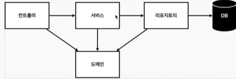

## 회원 관리 예제 

### 비즈니스 요구사향 정리
- 데이터: 회원ID, 이름
- 기능: 회원 등록, 조회
- 아직 데이터 저장소가 선정되지 않음

#### 일반적인 웹 애플리케이션 계층 구조



- 컨트롤러: 웹 MVC의 컨트롤러 역할
- 서비스: 핵심 비즈니스 로직 구현 예) 회원은 중복 관리가 안 됨.
- 리포지토리: 데이터베이스에 접근, 도메인 객체를 DB에 저장하고 관리
- 도메인: 비즈니스 도메인 객체 예) 데이터베이스에 저장하고 관리됨

### 회원 도메인과 리포지토리 만들기
- 리포지토리 만들기
    - Optional: 값이 없을 때 null을 optional로 감싸서 반환받는 방식

### 회원 리포지토리 테스트 케이스 작성
- 개발한 기능을 실행해서 테스트 할 때 자바의 main 메서드를 통해서 실행하거나, 웹 애플리케이션의 컨트롤러를 통해서 해당 기능을 실행
    - 단점: 이러한 방법은 준비하고 실행하는데 오래 걸리고, 반복 실행하기 어렵고 여러 테스트를 한번에 실행하기 어려움
    - 해결책: 자바는 JUnit이라는 프레임워크로 테스트 케이스를 작성해서 실행
- 테스트 코드를 작성할 때는 순서와 상관없이 테스트 코드 별로 따로 동작할 수 있도록 만들어야 한다.
    - 테스트 코드로 인해서 생성된 데이터로 인해 영향을 받을 수도 있기 때문에 하나의 테스트 코드가 끝날 때마다 지워준다.
    ```
    @AfterEach
    public void afterEach() {
        repository.clearStore();
    }
    ```
    - AfterEach: 한 동작이 끝날 때마다 일어나게 만드는 것