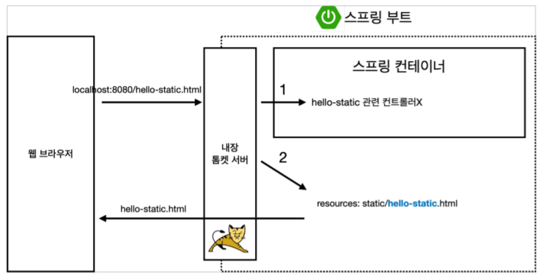

# study_springboot

### 목차
[1. 프로젝트 생성 방법](#Spring-boot-프로젝트-생성하는-법)

[2. 라이브러리 살펴보기](#라이브러리)

[3. View 환경설정](#View)

[4. 빌드하고 실행하기](#Build)

[5. 정적 컨텐츠](#정적-컨텐츠)

## Spring boot 프로젝트 생성하는 법
1. 스프링 부트 스타터 사이트[https://start.spring.io]로 이동해서 스프링 프로젝트 생성
2.  다음과 같이 설정한 후 'Generate'버튼 클릭
    - Group: 회사이름
    - Articact: 프로젝트 이름
    - SNAPSHOT: 개발 중인 것을 의미


3. IntelliJ 에서 'Open or Import'에서 압축을 푼 폴더 안으로 들어가 'bulid.gradle'을 선택하고 'Open'->''Open as Project'을 클릭
4. src-> main -> java -> HelloJavaSpringApplication.javafmf 'RUN을 누르면 [localhost:8080]을 들어가서 'Whitelabel Error Page'가 뜨면 성공!

## 파일 구조
- src
    - main:
        - java : 실제 소스 파일이 존재
        - resources : 시레 자바 코드를 제외한 설정 파일들이 존재
    - test: 테스트 코드와 관련된 소스 파일이 존재
- build.gradle
    - thymeleaf : html을 만드는 템플릿 엔진

## 라이브러리
- spring-boot-starter-web
- spring boot 라이브러리
    - spring-boot-starter-tomcat: 톰캣 (웹서버)
    - spring-webmvc: 스프링 웹 MVC
    - spring-boot-starter-thymeleaf: 타임리프 템플릿 엔진(View)
    - spring-boot-starter(공통): 스프링 부트 + 스프링 코어 + 로깅
        - spring-boot
            - spring-core
        - spring-boot-starter-logging
            - logback, slf4j
- test 라이브러리
    - junit: 테스트 프레임워크
- mockito: 목 라이브러리
- assertj: 테스트 코드를 좀 더 편하게 작성하게 도와주는 라이브러리
- spring-test: 스프링 통합 테스트 지원

## View
- `resources/static/index.html`에 넣는 파일이 Welcome Page가 됨
- Wep application에서 맨 처음의 진입점이 Controller

- /hello라고 던지면 내장 톰켓 웹 서버를 통해 'helloController'에 @GetMapping("hello")에 매핑이 되서 해당 method가 실행. 
- method 안의 model이 넘어와서 만들어지게 되고 return 된 이름의 templates으로 'viewResolver'라 화면을 찾아 랜더링.
    - viewResolver
        - 스프링 부트 템플릿엔진 기본 viewName 매핑
        - resources:templates/ +{ViewName}+ .html

### Template Engines
- freemarker
- groovy
- thymeleaf
- mustache

## Controller
- `@GetMapping()`: web application에서 해당 keyword로 들어오면 해당 method를 호출

## Model
```
    public String hello(Model model) {
        model.addAttribute("data", "hello!!");
        return "hello";
    }
```
- hello.html의 thymeleaf를 선언한 {data} 부분에 'hello!!'로 치환

## Build
- CIL에 spring boot 프로젝트가 있는 폴더에 들어가 `./gradlew build`를 하면 설치가 되고
- build -> lib 폴더에 들어가 `java -jar hello-spring-0.0.1-SNAPSHOT.jar`를 하면 spring이 실행됨.

## 정적 컨텐츠
- 정적 컨텐츠 vs MVC와 템플릿 엔진 vs API
    - 정적 컨텐츠: 파일을 그대로 웹 브라우저에 전달해주는 것
    - MVC와 템플릿 엔진: 서버에서 변형을 해 html을 바꿔서 내려주는 방식
    - API: json을 이용해서 client한테 데이터를 전달해주는 방식

- static에 html 파일을 생성해 준 후, '/파일이름.html'으로 들어가주면 해당 파일을 가능(그대로 반환 )


#### 기타
- spring-boot-devtools 라이브러리를 추가하면, html 파일을 컴파일만 해주면 서버 재시작 없이
View 파일 변경이 가능